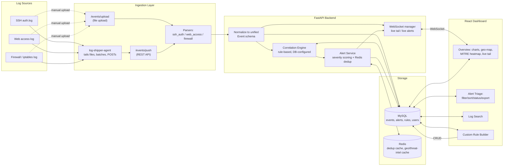

# SentinelView

A self-hosted, single-node SIEM (Security Information and Event Management)
dashboard for log aggregation and rule-based threat correlation. Built as a
portfolio project to demonstrate a realistic SOC analyst workflow end to end:
ingest → normalize → correlate → alert → triage → report.

No ML. No black boxes. Every alert traces back to a specific, human-readable
rule and the exact events that triggered it.

---

## Architecture



**Tech stack:** FastAPI (Python) · React + TypeScript + Tailwind + Recharts ·
MySQL · Redis · JWT auth with RBAC (Admin / Analyst / Viewer) · Docker Compose.

---

## Repository layout

```
/backend              FastAPI app, correlation engine, parsers, API
  /app
    /api               Route handlers (auth, events, alerts, rules, dashboard, reports, ws)
    /core              Config, DB session, security/JWT, RBAC dependencies
    /models             SQLAlchemy models (User, Event, Alert, DetectionRule, IngestionSource)
    /parsers            SSH / web access / firewall log parsers -> unified schema
    /rules              Built-in rule definitions (seed data)
    /schemas            Pydantic request/response models
    /services           Correlation engine, alert service, ingestion, geoip, notifications, threat intel
    /ws                 WebSocket connection manager
  /scripts/seed_demo_data.py   Generates realistic logs + simulated attacks
/frontend              React + TypeScript + Tailwind + Recharts dashboard
/log-shipper-agent     Lightweight Python agent: tails a log file, ships to the API
/docker-compose.yml    One-command deployment (MySQL + Redis + backend + frontend)
/docs                  Additional docs
```

---

## Quick start (Docker, recommended)

```bash
git clone <this-repo>
cd sentinelview

# 1. Bring up MySQL, Redis, backend, frontend
docker compose up --build -d

# 2. (Optional but recommended for a demo) seed realistic sample data +
#    simulated attacks so the dashboard isn't empty:
docker compose --profile demo run --rm seed

# 3. Open the dashboard
open http://localhost:8080
```

Log in with the demo accounts created by the seed script (all password
`ChangeMe123!` — **change these before any real deployment**):

| Username  | Role    |
|-----------|---------|
| `admin`   | Admin   |
| `analyst` | Analyst |
| `viewer`  | Viewer  |

If you don't run the seed script, register your own account at
`/login` → the **first user to register automatically becomes Admin**.

The backend API docs (Swagger UI) are available at `http://localhost:8000/docs`.

---

## Quick start (without Docker)

```bash
# Backend
cd backend
python3 -m venv .venv && source .venv/bin/activate
pip install -r requirements.txt
cp .env.example .env   # point at your own MySQL/Redis if not using Docker
uvicorn app.main:app --reload

# In another terminal: seed demo data
python -m scripts.seed_demo_data

# Frontend
cd frontend
npm install
cp .env.example .env
npm run dev
```

---

## Streaming real logs with the log-shipper agent

The agent in `/log-shipper-agent` tails a file like `tail -f` and forwards
new lines to the ingestion API in small batches:

```bash
cd log-shipper-agent
pip install -r requirements.txt

python3 shipper.py \
  --file /var/log/auth.log \
  --source-type ssh_auth \
  --api-url http://localhost:8000/api/v1/events/push \
  --api-key change-me-shared-secret   # matches INGEST_API_KEY in backend/.env
```

Run one instance per log file (SSH, web access, firewall). A sample
`systemd` unit template is included for running it as a service on a real
box. You can also push logs programmatically without the agent at all —
`POST /api/v1/events/push` accepts either raw lines (parsed server-side) or
already-normalized event objects.

---

## How detection works

Every alert on the dashboard is produced by the **rule-based correlation
engine** (`backend/app/services/correlation_engine.py`) — there is no ML
model and no hidden scoring. The flow is:

1. A log line is parsed into the **unified event schema**:
   `{timestamp, source_ip, destination_ip, event_type, severity, raw_message,
   source_type, user, status_code}`.
2. The event is written to MySQL (indexed on `timestamp`, `source_ip`, and
   `severity` for fast windowed queries).
3. The event is evaluated against every **enabled** row in the
   `detection_rules` table. Each row has a `rule_type` (which handler
   function runs) and a free-form JSON `config` (thresholds, time windows).
4. If a rule's condition is met, the **Alert Service** raises (or updates)
   an alert:
   - Severity is computed from the rule's base severity + weight +
     how many times the pattern has recurred.
   - **Redis-backed deduplication** collapses repeat firings of the same
     rule against the same source within a rolling window into a single,
     updated alert — this is what keeps a real brute-force attempt from
     flooding the triage queue with 200 near-identical alerts.
   - Critical-severity alerts optionally fan out to a Slack/Discord webhook
     and/or email.

### Built-in rules

| Rule | MITRE ATT&CK | What it looks for |
|---|---|---|
| Brute Force Login Detection | T1110 | N failed logins from one source IP within a rolling window |
| Port Scan Detection | T1046 | One source IP touching many distinct destination ports quickly |
| Impossible Travel / Anomalous Login | T1078 | Same user authenticating successfully from two geo-distant IPs faster than physically possible (geo-IP + haversine distance + time delta) |
| Privilege Escalation Pattern | T1548 | A spike in sudo/su usage from one account |
| Web Attack Signature (SQLi/XSS) | T1190 | Request paths matching known SQL injection / XSS patterns |

### Extending it: the "custom rule builder"

Adding a **new instance** of an existing rule type (e.g. a stricter
brute-force threshold for a specific admin panel) requires zero code
changes — it's just a new row in `detection_rules`, created either via the
**Detection Rules** page in the UI or `POST /api/v1/rules`:

```json
{
  "name": "Strict brute-force on admin panel",
  "rule_type": "brute_force",
  "severity": "critical",
  "weight": 3,
  "mitre_technique_id": "T1110",
  "config": { "window_seconds": 60, "threshold": 3 }
}
```

Adding a genuinely new **detection strategy** (a new `rule_type` the engine
doesn't know how to evaluate yet) means adding one handler function to
`correlation_engine.py` and registering it in `RULE_HANDLERS` — everything
else (storage, API, UI, alerting, reporting) is already generic and needs no
changes.

Admins can also retune any built-in rule's threshold, window, severity, or
disable it entirely (`PATCH /api/v1/rules/{id}`) without touching code —
built-in rules can't be *deleted*, only disabled, so the engine's baseline
coverage can't be silently removed.

---

## Role-based access control

| Role | View dashboard/alerts/search | Triage alerts (change status) | Manage detection rules | Manage users |
|---|---|---|---|---|
| Viewer | yes | no | no | no |
| Analyst | yes | yes | no | no |
| Admin | yes | yes | yes | yes |

Enforced server-side via FastAPI dependencies (`app/core/deps.py`), not just
hidden in the UI — the API returns `403` for out-of-role requests regardless
of what the frontend shows.

---

## Reporting

From the Alert Triage page, export either:
- **CSV** — all matching alerts in tabular form, or
- **PDF** — a formatted incident report per alert, including related
  event details.

Both are available for a single alert or for a time range
(`GET /api/v1/reports/incident.csv|pdf?alert_id=...` or `?start=...&end=...`).

---

## Nice-to-haves included

- **Threat intel enrichment**: `GET /api/v1/threat-intel/{ip}` checks a
  source IP against AbuseIPDB's free tier (set `ABUSEIPDB_API_KEY` in
  `.env` to enable — the feature no-ops gracefully without it).
- **Alert dedup** via Redis is core to the alerting system, not optional —
  see "How detection works" above.

Not included by design (see the original spec's explicit exclusions): ML-based
anomaly detection, arbitrary/pluggable log format support beyond the three
parsers, and multi-node/distributed deployment. The SOAR-style auto-block-an-IP
action was left out of this MVP in favor of the severity/weight scoring and
threat-intel lookup — it's a natural next addition given the existing
`raise_alert` hook point in `alert_service.py`.

---

## Screenshots

Run the app locally (`docker compose up` + seed script) and open
`http://localhost:8080` — the Overview page will show live charts, a geo
distribution map, MITRE ATT&CK heatmap, and a live event tail populated by
the seeded simulated attacks within a few seconds.

---

## Deploying

- **Backend**: any host that can run Docker (Render, Railway, Fly.io, a VPS)
  works via `backend/Dockerfile`. Point it at a managed MySQL + Redis
  instance (or run them as sidecar services) and set the environment
  variables from `backend/.env.example`.
- **Frontend**: `frontend/Dockerfile` builds a static bundle served by
  nginx — works on Vercel/Netlify/Render as a static site too (build with
  `VITE_API_URL`/`VITE_WS_URL` pointed at your deployed backend).

---

## Security notes for anyone extending this

- Change `JWT_SECRET_KEY` and `INGEST_API_KEY` before deploying anywhere
  reachable from the internet.
- The demo seed script creates admin/analyst/viewer accounts with a shared
  well-known password — rotate or delete them in any non-local deployment.
- The ingestion push endpoint (`/events/push`) is authenticated with a
  shared API key rather than a user JWT, since it's meant for
  machine-to-machine traffic from the log-shipper agent — treat that key
  like a secret.
